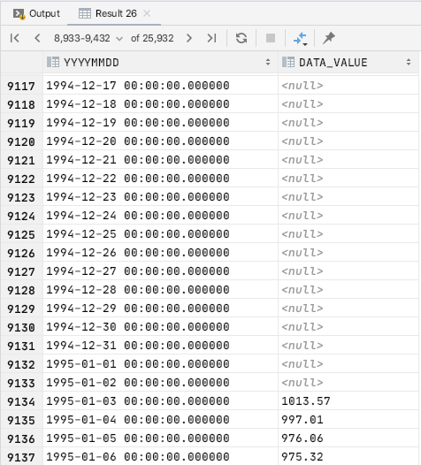

# LEFT JOIN 요녀석 querydsl로 해도 될까?
보통 Team <-> Member 뭐 요런 논리적 모델이면 상관이 없다.  
그런데 1960/01/01 ~ 2040/12/31 까지 모든 데이터를 시간축 기준으로 left outer join 을 하려면  
querydsl 상에서는 메모리 상에서 FetchType.Lazy로 모두 메모리에 넣어두고 써야 하는데, 이것을 엔티티 그래프로 모두 메모리에 가지고 있는게 맞을까?
하는 생각이 들었다. 보통 
- 팀안에 어떤 멤버가 속하는지
- 어떤 부서에 어떤 직원이 포함되는지

등과 같은 데이터는 이렇게 해도 된다. 실제로 그런 데이터이기 때문이다. 
그런데...
- 1995/01/03 의 kospi 지수 ~ 2020/01/03 의 데이터

와 같은 시간 축에 대한 데이터들을 일일이 메모리에 엔티티 그래프로 가지고 있을 필요가 있을까 하는 생각이 들었다. 굳이 1차 메모리 캐시로 가지고 있어도 될까?
메모리를 너무 많이 소모하는건 아닐까? 하는 생각이 들었다.

이런 이유로 대체제로 사용가능한 여러 라이브러리들을 정리해봤다.
- Mybatis
    - 현재 회사에 오기 전까지 너무나 잘 사용해온 라이브러리이다.
    - 초기 개발시에 원하는 데이터를 RAW SQL 기반으로 뽑아낼 수 있다는 점이 장점이다.
    - 단점은, 초기 개발 이후 고도화시 type-safe 하지 않다는 점이 있다.
    - 이전에도 stock-data-api 라는 이름으로 프로젝트를 만들었었는데 이때 mybatis와 jpa를 혼용해 사용했다.
    - 현재는 Mybatis 외의 조회를 위한 SQL Querying 라이브러리를 공부하는 것이 목적이기 때문에 배제했다.
    - 나한테 아직 Mybatis는 치트키처럼 느껴진다.
- QueryDsl
    - 아직 QueryDsl의 장점은 잘 못느끼고 있다.
    - 유지보수시 컴파일 타임에 type-safe 하게 유지보수할 수 있도록 도와준다.
    - Expression 기반으로 조건 식들을 제품에 맞도록 특화가 가능하도록 하는 것이 가능하다.
    - 단점으로는 left join 시 엔티티 매핑을 통해 엔티티 그래프를 메모리에 생성한다는 점이다.
- jooq
    - queryDsl과 유사한 dsl 계열의 SQL Querying 라이브러리이다.
    - 유지보수시 컴파일 타임에 type-safe 하게 유지보수할 수 있도록 도와준다.
    - 엔티티 매핑 없이도 left join 이 가능하다.
    - Expression 등이 가능한지는 공부를 해보아야 한다.
    - 추후 jooq 를 공부해보면서 적용해보려 한다.
  
# 해보려고 하는 것
## sql
```sql
SELECT t.YYYYMMDD, k.DATA_VALUE
FROM date_axis_dd t
LEFT OUTER JOIN KOSPI_DAY k
    ON t.YYYYMMDD = k.TIME
```
  
원하는 출력결과의 모습은 아래와 같다.  



그림에서 보이듯이 95년도 이후로 데이터가 들어와있고, 94년도 이전에는 데이터가 없다. 그리고 추후 연동할 데이터인
미국/한국 중앙정부 금리는 1960년도 부터의 데이터가 모두 존재한다. 
- 코스피 일별 종가
- 미국/한국 중앙정부 금리
- 원/달러 환율  
  
을 모두 하나의 그래프에 표시해야 한다. 라인 차트로 표시해야 하고, 하나의 쿼리에서 모두 Join으로 가져와서 표시하면 된다.  
또는 entity 매핑으로도 가져올 수 있다. 예를 들면 코스피의 경우 데이터가 없는 1960년~1994년도의 데이터는 null 로 표시해주어야 한다. 
즉, left outer join 을 해야 한다는 이야기이다.
