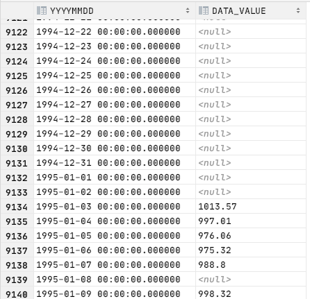

# LEFT JOIN 요녀석 querydsl로 해도 될까?
보통 Team <-> Member 뭐 요런 논리적 모델이면 상관이 없다.  
그런데 1960/01/01 ~ 2040/12/31 까지 모든 데이터를 시간축 기준으로 left outer join 을 하려면  
querydsl 상에서는 메모리 상에서 FetchType.Lazy로 모두 메모리에 넣어두고 써야 하는데,
장단점이 있는 것 같아 고민내용을 적어보려 한다.  
우선 장점
 - QueryDsl을 쓴다는것
 - jooq 같은 것을 쓴다면 운이 없으면 비용지불도 감수해야 한다.
 - mybatis 를 쓰지 않아도 된다는 것  
단점
 - 시간 축으로 left join에 굳이 엔티티매핑이 필요한가이다.
 - querydsl에서는 앤티티 매핑 없이 left join 지원이 불가능하고 join(...).on 만을 지원하는데 이렇게 하면 inner join 으로 내부적으로 변환된다.
 - inner join을 사용하게 되면... 
    - 1994년도 처럼 kospi 가 개장하지 않은 시점의 데이터는 자르고 데이터가 존재하는 시점인 95년도부터만 데이터를 가져오게 된다.
    - 미국 증시/금리 데이터도 같이 연동해야 하므로 개장 전의 null 데이터도 모두 들고와야 하는데, inner join 으로는 이것이 불가능하지...
    - 결국 left join 이 필요하게 된다.
    - 아래는 left join 으로 데이터를 들고 온 경우의 캡처사진이다.
    - 
 - h2console 에서 실행해본 쿼리는 아래와 같다.

```sql
SELECT t.YYYYMMDD, k.DATA_VALUE
FROM date_axis_dd t
LEFT OUTER JOIN KOSPI_DAY k
    ON t.YYYYMMDD = k.TIME
```

 
 
  
 