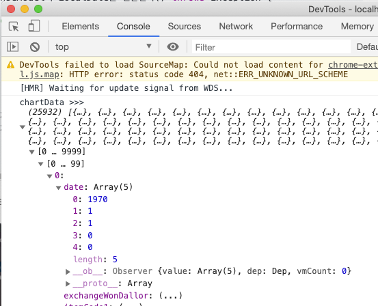
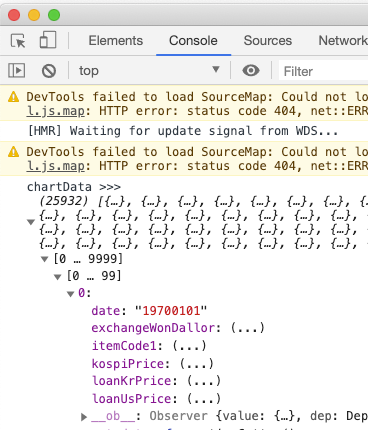

# LocalDate 의 ResponseBody 처리
# 1. Dto 의 LocalDate, LocalDateTime을 그대로 Web 계층으로 리턴할 때 
LocalDateTime 또는 LocalDate로 선언된 Dto의 필드를 그대로 frontend 로 넘겨주면 frontend 에서는 아래의 결과로 받게 된다.  

## 출력결과


Date가 이상한 형태로 나타난다.  

## Dto 코드
위 예제에서 사용한 Dto의 코드는 아래와 같다.
```java
@Data
public class TrendingDto {
	private LocalDateTime 	date;

	private String 			itemCode1;
	private Double 			kospiPrice;
	private Double 			loanUsPrice;
    // ...
}
```

# 2. Dto 에 따로 처리를 해주자.
@JsonFormat 을 사용해 변환해주자. Json으로 리턴시에는 String으로 변환하되 pattern을 지정해 넘겨준다.
## 출력결과


## Dto 코드
```java
import com.fasterxml.jackson.annotation.JsonFormat;
import com.fasterxml.jackson.annotation.JsonFormat.Shape;
import lombok.Data;

@Data
public class TrendingDto {

	@JsonFormat(shape = Shape.STRING, pattern = "yyyyMMdd", timezone = "Asia/Seoul")
	private LocalDateTime 	date;

	private String 			itemCode1;
	private Double 			kospiPrice;
	private Double 			loanUsPrice;

    // ...
}
```

# 3. 참고자료
[Spring Boot 에서 날짜 타입 JSON 변환에 대해 오해 풀기](https://jojoldu.tistory.com/361)
