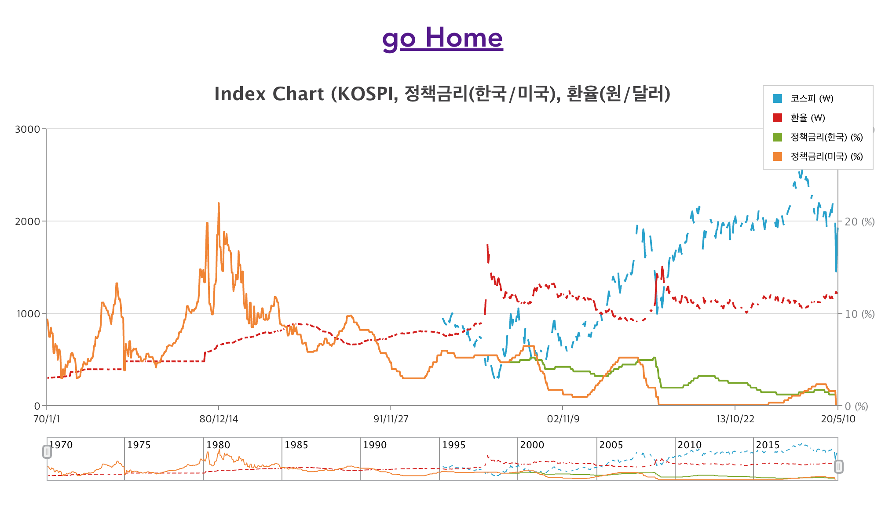
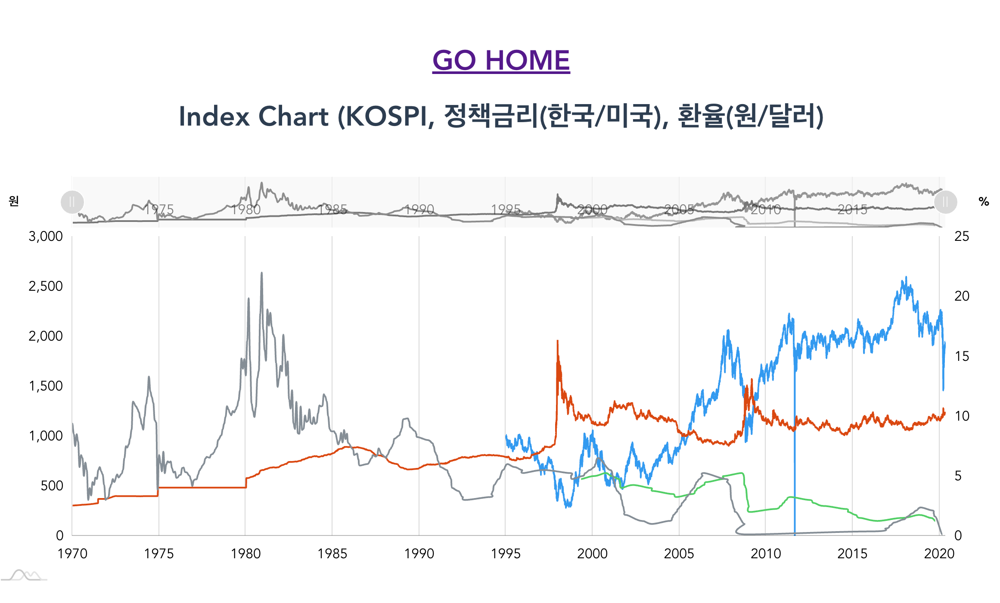

# 5월 ~ 6월 TO-DO LIST
- Database 의 모든 테이블에 대한 Time 관련 컬럼들 모두 ERD 재설계
- JPA Entity 매핑시 LocalDate 또는 Date 관련 항목 매핑 방식 결정
    - 참고자료
        - [해외 자료 : hibernate-jpa-date-and-time](https://thoughts-on-java.org/hibernate-jpa-date-and-time/)
        - [해외 자료 : How To Map The Date And Time API with JPA 2.2](https://thoughts-on-java.org/map-date-time-api-jpa-2-2/)
        - [Java 8 Date(Time) 와 JPA 그리고 스프링 부트](https://www.popit.kr/java-8-datetime-%EC%99%80-jpahiberante-%EA%B7%B8%EB%A6%AC%EA%B3%A0-%EC%8A%A4%ED%94%84%EB%A7%81-%EB%B6%80%ED%8A%B8/)
        - [Spring Data JPA 에서 Java8 Date-Time(JSR-310) 사용하기](https://homoefficio.github.io/2016/11/19/Spring-Data-JPA-%EC%97%90%EC%84%9C-Java8-Date-Time-JSR-310-%EC%82%AC%EC%9A%A9%ED%95%98%EA%B8%B0/)

# 0. 진행상황 
## zingchart 기반 차트
**KOSPI, 정책금리(미국/한국), 환율(원/달러)**

  
## amchart 기반 차트
**KOSPI, 정책금리(미국/한국), 환율(원/달러)**

## 진행상황 (5월 2주차)
- 차트
    - 데이터를 차트에 표시하는 기본 기능은 완료
    - 차트 자체의 렌더링 속도만 비교해보면 zingchart가 amchart 보다 압도적으로 빨랐다. 그 이유는 아무래도 amchart가 zingchart에 비해
        - null 처리가 자동화 되어있기도 하고
        - object의 배열을 key1: [배열1], key2: [배열2] 등의 처리를 내장 엔진이 담당하는 부분도 무시할 수 없다.
        - 애니메이션 기능에 특화되어 있어서이기도 해보인다.
    - 아직은 amchart에서 제공하는 편의 기능을 당장에 포기하기도 쉽지는 않지만, 일단은 zingchart 기반으로 더 발전시켜볼까 한다.
- API
    - Trending API
        - Trending은 1960년도 ~ 2040년 까지의 데이터를 가져온다. KOSPI/환율의 경우는 일별 데이터 이고, 정책금리(미국/한국)은 월별 데이터이다.
        - KOSPI/환율의 경우는 일별 데이터 대신 월별 데이터로 변경하려 한다.
        - 정책금리의 경우는 그대로 월별 데이터를 사용하고자 한다.
        - 데이터에 대한 기획점 변경 필요  
            - (2020/05/13)   
                - 해당 기간의 데이터를 DB에서 최대한 raw 데이터로 인출해오고 그 후 일별 데이터 들에 대해 각 월별 최소/최대/평균을 구하는 Stream API를 구현했다.
                - start_date, end_date 파라미터
                    - (기본 설정) 최초 index.html 요청시 보여줄 데이터의 start_date, end_date는 어떻게 할 것인지
                    - (조회시 파라미터 설정) 조회시 몇 년치의 데이터를 최대로 할지
                - 각 지표 데이터의 데이터 인출 전략
                    - 각 지표 데이터마다 각각 따로 left join 을 해서 각각 데이터를 가져온다.
                    - 그럼 이 데이터를 backend에서 병합해서 통으로 전달해주는 경우의 API와
                    - 이 데이터를 각각의 데이터로 가공해서 전달해주는 경우  
                    - 이 경우들에 spread sheet 에 정리해서 개발단계에서의 문서화를 해두자.  

- stock_data 프로젝트와 비교해보았을때  
    - 렌더링 속도는 어느정도 비슷했다.
    - 하지만 지금은 tool tip이 잘 동작하지 않는다. 그 이유는 2만건 이상의 데이터가 굉장히 좁은 영역에 압축되어 있기 때문에 마우스 오버 액션 동작시 차트의 어느 부분을 가리킬지 모르는 것으로 보인다.
    - 일단, stock_data_api 에서 Stream API를 이용해 커스터마이징 했던 부분이 있던 것으로 기억하는데, 해당 내용을 다시 확인해봐야 할 듯하다. 

## 비교 (2019년도 5월 진행 - stock_data)
[stock_data 프로젝트(2019년도)](https://github.com/soongujung/stock-data)

# 1. 데이터 추가
- 미국 다우존스, S&P (한국은행 API)
- 금, 은 가격 (한국은행 API)

# 2. Trending API
## QUERY 분리
- 현재 KOSPI, 중앙정부 정책금리(미국,한국), 환율(원/달러)를 시간축 기준으로 모든 일별데이터에 대해 Left Join 한방으로 처리하고 있다.  
  (현재 소스는 결과를 빠르게 파악하기 위한 임시방편으로 조금은 대충 작성한 API이다.)
  2020/05
    - 이 내용을 
        - KOSPI
        - 중앙정부 정책금리(미국,한국)
        - 환율(원/달러)
    
      로 따로 따로 SQL을 호출한 후, Java에서 병합하도록 하기, Java8 및 Collectors 적극활용
  2020/06
    querydsl 로 년+월로 groupby가 안되는줄 알았다. 하지만
    [QueryDsl 4.1.3 API DOC](https://www.youtube.com/watch?v=mrtHd0WXhdM&feature=share)를 참고해본 결과 가능하다.
    이 방식으로 년/월의 최대/최소 값을 구하려 한다. 대신 모든 지표 통합데이터를 API한방으로 처리하는 것이 아닌 지표별 통계 데이터를 산출하자.
      
       
- 통합 쿼리 말고도 각 데이터 별 trend chart api 만들기
    
    
## startDate, endDate 파라미터 연동 API 작성

# 3. BatchNomy
- Data Insert 로직들을 Spring Batch로 돌아가도록 하기
- 일부 yahoo finance 등을 사용해야 하는 데이터를 제외하고 모두 Spring Batch로 돌아가도록 수정

# 4. Front End
## 차트 로직  
- 기본 차트 구현
- Y(ValueAxis)축 여러 개를 두도록 구성
    - % 단위축 : 금리 표현을 위한 데이터 축
    - 원 단위축 : 주가지수, 환율을 위한 데이터 축
    - [참고자료](https://github.com/soongujung/stock-data/blob/master/stock-data-api/src/main/resources/templates/trending/web/closing_price/index.html)
     
- 렌더링 로직 공통으로 만들기 
- 차트 div와 객체 생성후 SeriesLine 은 나중에 생성하는 지연된 로딩 사용할 것.
    - 코스피, 금리(한국/미국), 환율 을 rest api 데이터에서 하나 하나 쪼개서 (ex. obj['kospiPrice'], obj['loanRateKr'], ...) 지연로딩 되도록 구성
    - 데이터 개별조회 API에 대한 차트...도 추후 추가 ^^;;;
    
- amcharts 대신 다른 opensource chart 고려해보자 
    - [zingChart](zingchart.com/gallery/open-high-low-close-chart-with-preview-and-interactive-crosshairs)
    - [recharts](http://recharts.org/en-US/examples/SynchronizedLineChart)
    - [chartist.js](http://gionkunz.github.io/chartist-js/)
    - 참고자료
        - [18+ JavaScript Libraries for Creating Beautiful Charts](https://www.sitepoint.com/best-javascript-charting-libraries/)
        - [10 Free JavaScript Data Chart Libraries Worth Considering](https://speckyboy.com/open-source-javascript-data-chart-libraries/)
    
# 5. Security
- 스프링 시큐리티, JWT 방식 + 네이버로그인 구현